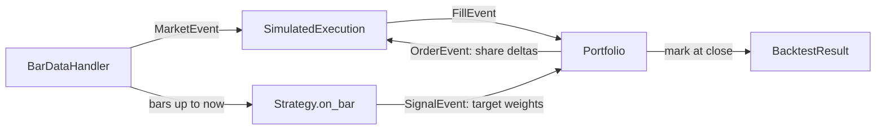

# backtester

An event-driven backtesting engine in Python with a vectorized fast path, where
**both engines must agree on every fill to floating-point precision**. The
event-driven engine is the source of truth; the vectorized path is for fast
parameter sweeps; the parity test suite is what makes the fast path trustworthy.

```
MA crossover (trending)    parity gap $4.66e-10   event 0.053s   vectorized 0.007s   (7x)
Z-score MR (OU)            parity gap $1.86e-09   event 0.070s   vectorized 0.012s   (6x)
Pairs (cointegrated)       parity gap $4.66e-10   event 0.138s   vectorized 0.019s   (7x)
```

## Quick start

```bash
pip install -e ".[dev]"            # numpy, pandas, pytest, matplotlib
pytest                             # 31 tests
python examples/synthetic_demo.py  # all strategies, both engines, plots in output/
python examples/param_sweep.py     # grid search in-sample, confirm out-of-sample

pip install -e ".[data]"           # adds yfinance
python examples/yfinance_demo.py --start 2010-01-01 --plot
```

```python
import backtester as bt

bars = bt.load_yfinance(["KO", "PEP"], start="2012-01-01")
strategy = bt.PairsTrading("KO", "PEP", lookback=250, z_window=60)
costs = bt.CostModel(slippage_bps=1, commission_per_share=0.005)

result = bt.EventDrivenBacktest(bars, strategy, costs=costs).run()
print(result.summary())
```

## Architecture



For each bar the engine pushes a `MarketEvent` onto a FIFO queue and drains it:

1. **Execution** fills orders queued on the previous bar at *this* bar's open,
   applying slippage and commission. Fills are queued first.
2. **Strategy** sees history up to and including this bar and may return new
   target weights, which become a `SignalEvent`.
3. **Portfolio** applies fills, then converts target weights into share deltas
   (`OrderEvent`s) against post-fill positions.
4. After the queue drains, the portfolio marks equity at the close.

| Module | Responsibility |
|---|---|
| `data.py` | Alignment across symbols, read-only bar replay, CSV and yfinance loaders |
| `events.py` | Frozen, slotted event dataclasses |
| `engine.py` | Event loop and dispatch |
| `portfolio.py` | Cash, positions, sizing, trade log |
| `execution.py` | Next-open fill simulation |
| `costs.py` | Slippage (bps), commission (bps and per share) |
| `vectorized.py` | The same accounting as whole-history array math |
| `strategies/` | MA crossover, z-score mean reversion, rolling-OLS pairs trading |
| `synthetic.py` | GBM, regime-switching trend, OU, cointegrated pair generators |
| `metrics.py` | Sharpe, Sortino, CAGR, max drawdown and duration, Calmar, turnover, exposure |

## Design decisions

**Timing convention.** A decision made on bar *t*'s close fills at bar *t+1*'s
open. Trading at the same close you computed a signal from is the most common
source of inflated backtests. Orders still pending after the last bar are dropped.

**Lookahead is structurally impossible in the event path.** `BarDataHandler.history()`
returns a read-only NumPy view ending at the current bar. Strategies cannot see
the future, and cannot mutate the data either. `tests/test_lookahead.py` shocks
all prices after bar *k* and asserts equity through bar *k-1* is bit-identical
for both engines.

**Parity as a correctness test.** Each strategy implements `generate_targets()`
(vectorized) and `on_bar()` (incremental). The vectorized indicators use
`sliding_window_view` so they perform the same floating-point operations as
`np.mean`/`np.std` on the trailing window, making the two paths reproducible
fill-for-fill. `test_parity_catches_lookahead` shows the payoff: a strategy that
peeks one bar ahead in its vectorized code looks spectacular, and the parity
check fails.

**Sparse targets.** Strategies emit weights only when their state changes, and
share counts are fixed at that moment. A position is not rebalanced every bar as
prices drift, which keeps turnover and costs realistic. For pairs, the hedge
ratio is locked at entry.

**Sizing.** `sizing="fixed"` (default) sizes against initial capital, so every
signal risks the same notional and results are comparable across time. That is
what the vectorized path supports. `sizing="equity"` compounds and is
event-driven only, because it is path-dependent.

**Known-answer tests.** Synthetic generators plant an edge on purpose
(mean-reverting prices, a cointegrated pair, persistent drift regimes), and
`tests/test_known_answers.py` asserts the matching strategy finds it and that
trend-following does materially better on trending data than on a driftless
random walk.

## Writing a strategy

```python
class MyStrategy(bt.Strategy):
    def __init__(self, symbol):
        self.symbols = (symbol,)

    def reset(self):                 # called before each event-driven run
        self._state = 0.0

    def generate_targets(self, bars):   # vectorized: DataFrame of weights, NaN = hold
        ...

    def on_bar(self, data):             # incremental: dict of weights, or None
        closes = data.history(self.symbols[0], n=50)
        ...
```

Implement `on_bar` first. Add `generate_targets` when you need speed, then add
a parity test for it.

## Limitations and next steps

- **Fill model.** Next-open fills with fixed-bps slippage. No volume
  participation limits, market impact, partial fills, or queue position.
- **Shorting.** No borrow fees, locate constraints, or margin requirements.
- **Data.** Free Yahoo data has survivorship bias and no corporate-action
  history beyond adjusted prices.
- **Overfitting.** `param_sweep.py` does one in-sample/out-of-sample split.
  Walk-forward optimization and a deflated Sharpe ratio would be the next step.
- **Market making.** Requires L2 or tick data and a queue-position model. A
  natural extension is replaying events through a C++ matching engine instead of
  `SimulatedExecution`, which the event interface is designed to allow.
