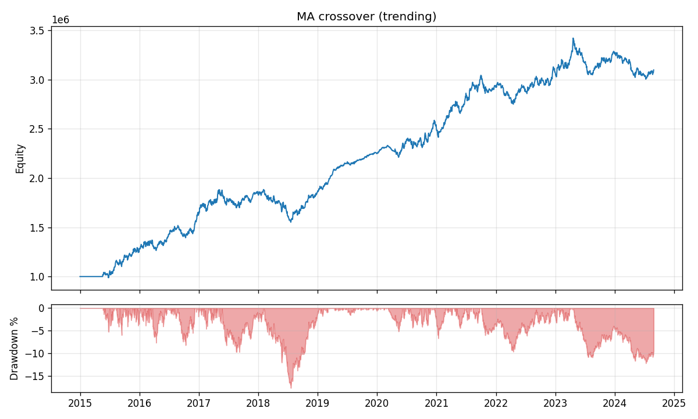
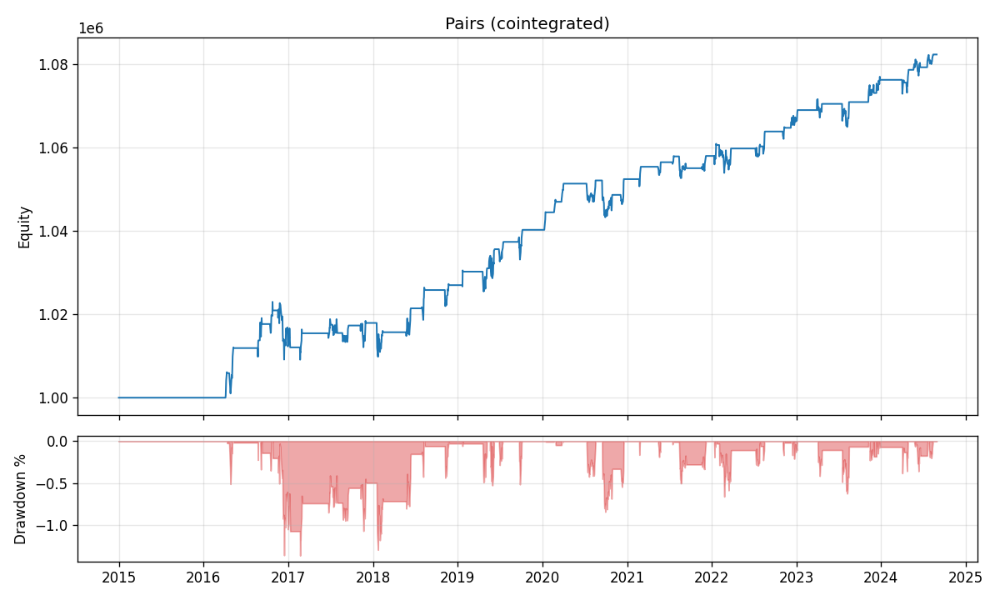
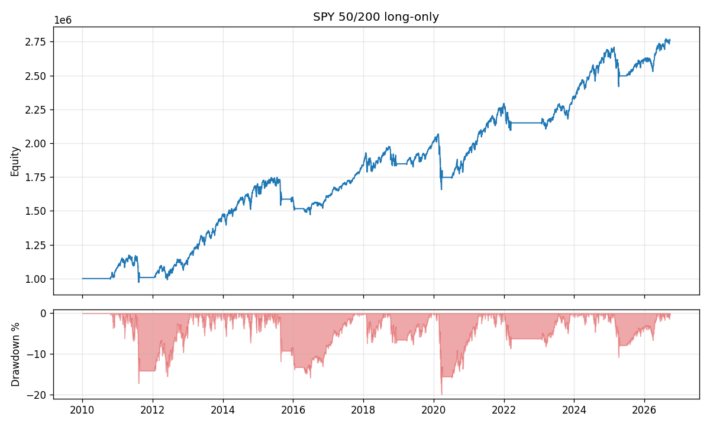
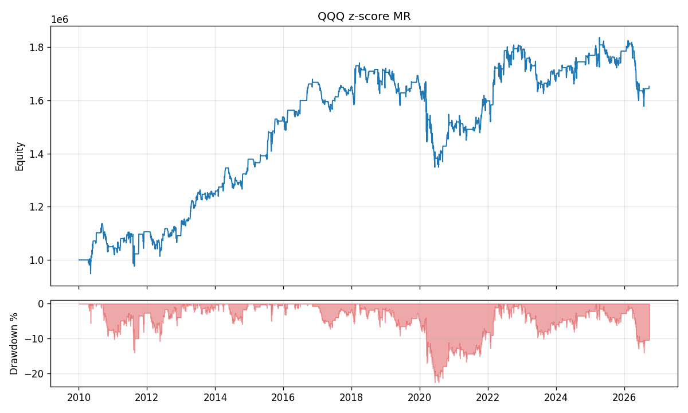
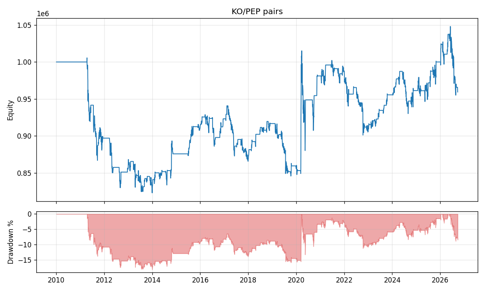
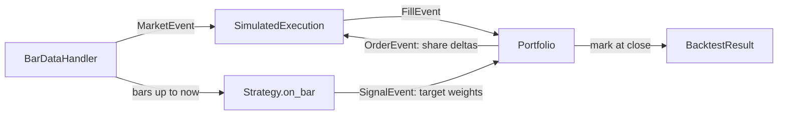

# backtester

An event-driven backtesting engine in Python with a vectorized fast path, where
**both engines must agree on every fill to floating-point precision**. The
event-driven engine is the source of truth, the vectorized path makes parameter
sweeps fast, and the parity test suite is what makes the fast path trustworthy.

Parity holds on real market data too. On 16 years of SPY, QQQ, KO and PEP
bars, the largest equity difference between the two engines was $4e-9 on a
$1M account.

## Quick start

```bash
# Linux / macOS / WSL
python3 -m venv .venv && source .venv/bin/activate
python -m pip install --upgrade pip
python -m pip install -e ".[dev,data]"

# Windows (PowerShell)
py -m pip install -e ".[dev,data]"
```

```bash
pytest                                      # 31 tests
python examples/synthetic_demo.py           # all strategies, both engines, plots in output/
python examples/param_sweep.py              # grid search in-sample, confirm out-of-sample
python examples/yfinance_demo.py --plot     # real market data (needs internet)
```

```python
import backtester as bt

bars = bt.load_yfinance(["KO", "PEP"], start="2012-01-01")
strategy = bt.PairsTrading("KO", "PEP", lookback=250, z_window=60)
costs = bt.CostModel(slippage_bps=1, commission_per_share=0.005)

result = bt.EventDrivenBacktest(bars, strategy, costs=costs).run()
print(result.summary())
```

## Results

### Synthetic data: do the strategies find an edge that is known to exist?

Each generator plants a specific edge: persistent drift regimes, a
mean-reverting price, and a cointegrated pair. Costs are 2 bps slippage plus
1 bp commission.

| | MA crossover (trending) | Z-score MR (OU) | Pairs (cointegrated) |
|---|---:|---:|---:|
| Sharpe | 1.13 | 1.53 | 0.81 |
| Max drawdown | -17.7% | -4.8% | -1.4% |
| Exposure | 96% | 32% | 22% |
| Fills | 22 | 202 | 184 |




The flat stretch at the start of each curve is indicator warmup: 100 bars for
the crossover, 250 + 60 for pairs. The staircase shape comes from sparse
positions, since equity only moves while a trade is open.

### Real data: do they survive real markets?

Daily bars from Yahoo Finance, 2010-01-01 to September 2026, 1 bp slippage plus
$0.005/share commission.

| | SPY 50/200 long-only | QQQ z-score MR | KO/PEP pairs | SPY buy & hold |
|---|---:|---:|---:|---:|
| CAGR | 6.3% | 3.1% | -0.3% | 14.2% |
| Sharpe | 0.67 | 0.35 | -0.01 | **0.86** |
| Max drawdown | **-19.9%** | -22.5% | -18.2% | -33.7% |
| Longest drawdown (bars) | 554 | 1,068 | 2,246 | 488 |
| Annual turnover | 0.55x | 13.5x | 9.5x | 0.02x |
| Total costs | $2,078 | $48,787 | $29,607 | $159 |

**None of the strategies beats buy-and-hold on a risk-adjusted basis.** That is
the expected result for textbook strategies, and the reasons are more
informative than the numbers.

**SPY 50/200 trend filter.** The strategy sat out the August 2011 sell-off,
2015–16, late 2018, March 2020 and most of the 2022 bear market, cutting the
max drawdown from -34% to -20%. The cost is lag: a 200-day average confirms a
downtrend after the damage is done, so the strategy exits late and re-enters
after much of the rebound. Part of the CAGR gap is also a measurement effect.
With `sizing="fixed"` each entry trades $1M of notional regardless of account
growth, while buy-and-hold compounds. `sizing="equity"` gives a
like-for-like comparison.



**QQQ z-score mean reversion.** It made money steadily from 2012 to 2018 while
QQQ moved in choppy swings, then lost about 22% in 2020. In a strong
one-directional move, mean reversion keeps betting on a reversal: it bought the
COVID crash too early and shorted the rebound too soon. It also paid $48,787 in
costs at 13.5x annual turnover. The edge exists in some regimes and not others,
which argues for a regime filter.



**KO/PEP pairs.** It lost about 15% from 2011 to 2013 as the spread kept
widening and never reverted, went sideways for most of a decade, and recovered
almost entirely on one jump in March 2020, when the COVID crash dislocated the
pair and it snapped back. A track record that depends on a single extreme event
is not an edge. The strategy assumes cointegration without testing for it, which
is the most important gap in this version (see next steps).



### Overfitting check

`param_sweep.py` grid-searches 24 MA crossover parameter pairs on the first 70%
of a synthetic series and scores the winner on the unseen 30%. In-sample Sharpe
was 1.18 and out-of-sample Sharpe was 0.85. The drop is the cost of picking the
best of many trials, and it is why in-sample Sharpe should never be reported
as the result.

## Architecture



For each bar the engine pushes a `MarketEvent` onto a FIFO queue and drains it:

1. **Execution** fills orders queued on the previous bar at *this* bar's open,
   applying slippage and commission. Fills are queued first.
2. **Strategy** sees history up to and including this bar and may return new
   target weights, which become a `SignalEvent`.
3. **Portfolio** applies fills, then converts target weights into share deltas
   (`OrderEvent`s) against post-fill positions.
4. After the queue drains, the portfolio marks equity at the close.

| Module | Responsibility |
|---|---|
| `data.py` | Alignment across symbols, read-only bar replay, CSV and yfinance loaders |
| `events.py` | Frozen, slotted event dataclasses |
| `engine.py` | Event loop and dispatch |
| `portfolio.py` | Cash, positions, sizing, trade log |
| `execution.py` | Next-open fill simulation |
| `costs.py` | Slippage (bps), commission (bps and per share) |
| `vectorized.py` | The same accounting as whole-history array math |
| `strategies/` | MA crossover, z-score mean reversion, rolling-OLS pairs trading |
| `synthetic.py` | GBM, regime-switching trend, OU, cointegrated pair generators |
| `metrics.py` | Sharpe, Sortino, CAGR, max drawdown and duration, Calmar, turnover, exposure |

## Design decisions

**Timing convention.** A decision made on bar *t*'s close fills at bar *t+1*'s
open. Trading at the same close you computed a signal from is the most common
source of inflated backtests. Orders still pending after the last bar are dropped.

**Lookahead is structurally impossible in the event path.** `BarDataHandler.history()`
returns a read-only NumPy view ending at the current bar. Strategies cannot see
the future, and cannot mutate the data either. `tests/test_lookahead.py` shocks
all prices after bar *k* and asserts equity through bar *k-1* is bit-identical
for both engines.

**Parity as a correctness test.** Each strategy implements `generate_targets()`
(vectorized) and `on_bar()` (incremental). The vectorized indicators use
`sliding_window_view` so they perform the same floating-point operations as
`np.mean`/`np.std` on the trailing window, making the two paths reproducible
fill-for-fill. `test_parity_catches_lookahead` shows the payoff: a strategy that
peeks one bar ahead in its vectorized code looks spectacular, and the parity
check fails.

**Sparse targets.** Strategies emit weights only when their state changes, and
share counts are fixed at that moment. A position is not rebalanced every bar as
prices drift, which keeps turnover and costs realistic. For pairs, the hedge
ratio is locked at entry.

**Sizing.** `sizing="fixed"` (default) sizes against initial capital, so every
signal risks the same notional and results are comparable across time. That is
what the vectorized path supports. `sizing="equity"` compounds and is
event-driven only, because it is path-dependent.

**Known-answer tests.** `tests/test_known_answers.py` asserts each strategy
finds the edge planted in its synthetic data, and that trend-following does
materially better on trending data than on a driftless random walk.

## Writing a strategy

```python
class MyStrategy(bt.Strategy):
    def __init__(self, symbol):
        self.symbols = (symbol,)

    def reset(self):                    # called before each event-driven run
        self._state = 0.0

    def generate_targets(self, bars):   # vectorized: DataFrame of weights, NaN = hold
        ...

    def on_bar(self, data):             # incremental: dict of weights, or None
        closes = data.history(self.symbols[0], n=50)
        ...
```

Implement `on_bar` first. Add `generate_targets` when you need speed, then add
a parity test for it.

## Limitations

- **Fill model.** Next-open fills with fixed-bps slippage. No volume
  participation limits, market impact, partial fills, or queue position.
- **Shorting.** No borrow fees, locate constraints, or margin requirements.
- **Data.** Free Yahoo data has survivorship bias and no corporate-action
  history beyond adjusted prices.
- **Pairs selection.** Cointegration is assumed, not tested.
- **Overfitting.** A single in-sample/out-of-sample split. No walk-forward or
  multiple-testing correction.

## Next steps

1. **Cointegration filter.** Run an Engle-Granger test on each rolling
   in-sample window and only trade the pair while the spread is stationary.
   Then scan a universe of candidate pairs.
2. **Walk-forward optimization** with a deflated Sharpe ratio to account for
   the number of parameter combinations tried.
3. **Matching engine execution.** Replace `SimulatedExecution` with a C++
   limit order book so fills depend on queue position and liquidity. The event
   interface is designed to allow this.
